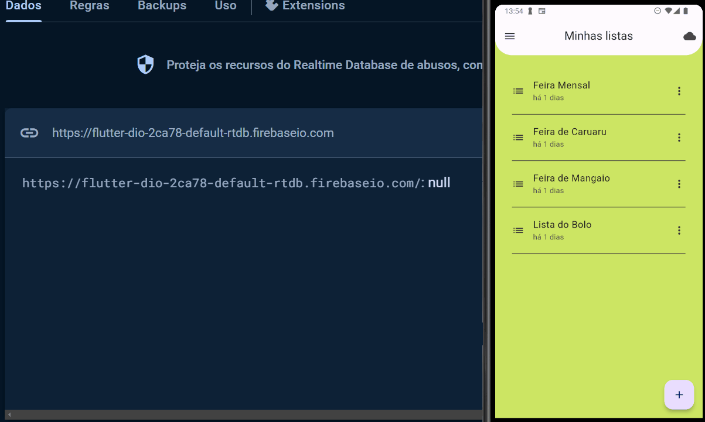

# Flutter: Comunicação Web API com Dio

O projeto Listin é um gerenciador de listas de compras para que você possa planejar sua feira e, no supermercado, possa anotar quanto já gastou para evitar surpresas na hora do caixa!

### Tópicos abordados no curso:

- Métodos HTTP básicos;
- Uso de cabeçalhos e parâmetros;
- Padronização de configurações;
- Desenvolvimento de um log;
- Configuração de interceptadores;
- Tratamento de erros;

Este curso é indicado para pessoas que já tem um bom conhecimento de Dart e Flutter e desejem tornar suas aplicações funcionais usando comunicação com APIs com o Dio, uma das ferramentas mais confiáveis e usadas do mercado;

## 📑 Requisitos

- Conhecimentos básicos de Flutter e Dart;
- VS Code com plugins do Flutter e Dart instalados (recomendado para acompanhar este curso);
- É importante ter o Flutter na versão 3.16.9.

## ✨ Funcionalidades do projeto

- Configurando o servidor (Realtime Database);
- Usando POST/PUT para adicionar e editar os dados do servidor;
- Usando o GET para obter informações do servidor;
- Usando o DELETE para remover dados do servidor;
- Configurando BaseOptions para cabeçalhos, timeouts e outras configurações;
- Enviando parâmetros para o servidor;
- Criando e usando interceptadores pra gerar um log auditável;
- Lidando com erros usando o DioException;
- Refatorando o código para boas práticas;

## 🛠️ Abrir e rodar o projeto

Aqui vem um passo a passo para abrir e rodar o projeto.

- **Open an Existing Project** (ou alguma opção similar)
- Procure o local onde o projeto está e o selecione (Caso o projeto seja baixado via zip, é necessário extraí-lo antes de procurá-lo)
- Por fim clique em OK
- Depois basta rodar o comando `flutter run` na pasta do projeto